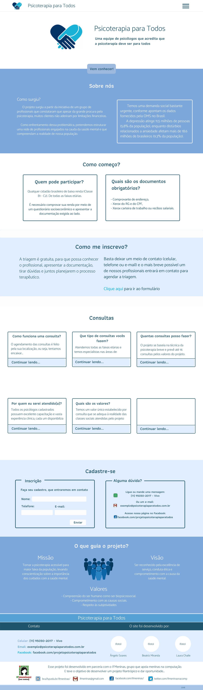
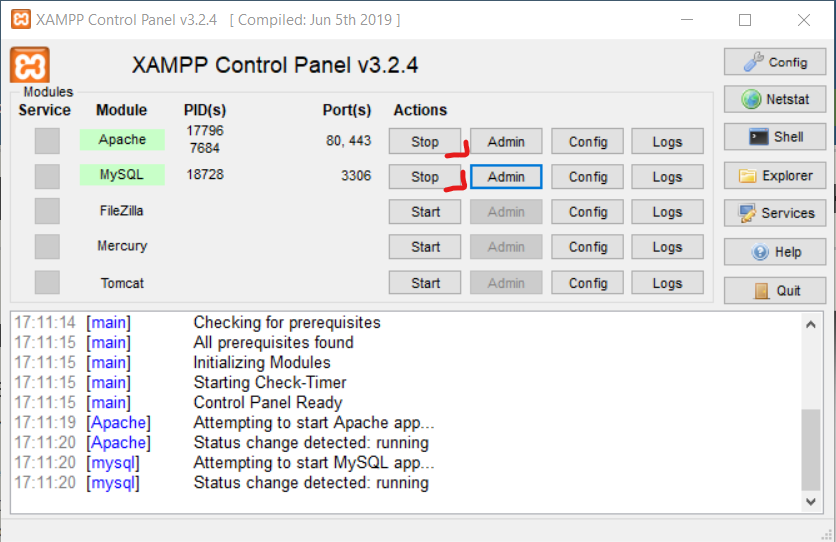

<h1 align="center">
    
</h1>

<h4 align="center"> 
	🚧 Projeto Psicoterapia para Todos 1.0 - sempre em construção... 🚧
</h4>

<p align="center">
  

  
  
  <a href="https://github.com/BeatrizMiranda/Psicoterapia/commits/master">
    
  </a>

  
</p>


## 💻 Sobre o projeto

Este projeto colaborativo foi o responsável por criar o site da ONG Psicoterapia Para Todos, um site Institucional onde a população pode obter contactar, se inscrever, e entender como funciona o projeto social.

No site os usuários terão acesso:
- Sobre nós
- Como começo?
- Como me inscrevo?    
- Consultas 
- Cadastre-se
- O que guia o projeto?

A iniciativa de criar o site nasceu quando a ONG entrou em contato com o Institudo Federal de Ciência Educação e Tecnologia de São Paulo, e o projeto de extensão IF{Meninas nas exatas} se responsabilizou pelo seu desenvolvimento.

## 🎨 Layout

O layout do site foi pensado a transimitir calma aos usuários, tendo em vista que a procura por saúde mental muitas vezes vem de alguém que já está no seu limite, buscamos manter a interface limpa, clara, e azul.

### Screens

<p align="center">
  
</p>

## 🛠 Tecnologias

As seguintes ferramentas foram usadas na construção do projeto:
- [HTML](https://www.w3schools.com/html/)
- [CSS](https://www.w3schools.com/CSS/)
- [PHP](https://www.w3schools.com/PHP/)
- [JavaScript](https://www.w3schools.com/js/)

## 🎥 Como executar o projeto

### Pré-requisitos

Antes de começar, você vai precisar ter instalado em sua máquina as seguintes ferramentas:
[Git](https://git-scm.com)
[Xampp](https://www.apachefriends.org/pt_br/index.html) 

Além disto é bom ter um editor para trabalhar com o código como [VSCode][vscode]

### :cat: Clonando o Repositório
Você deve colocar o seu repositorio dentro da pasta htdocs dentro da sua pasta xampp.
O default dessa pasta é `C:\xampp\htdocs` 

```bash
# Clone este repositório
$ git clone https://github.com/BeatrizMiranda/Psicoterapia
            
# Acesse a pasta do projeto no terminal/cmd
$ cd Psicoterapia

# Comando que abre seu editor direto na pasta
$ code .
```

### :repeat: Rodando a aplicação
Após clonado abra o xampp e coloque para iniciar o apache e o MySQL


Logo em seguida clique em admin no MySQL e importe o banco. (está na pasta `.\wp-content\themes\psicoterapia\banco\psicoterapia.sql`)
por fim entre no link `http://localhost/Psicoterapia`.

## :raising_hand: Para contribuir com o projeto

1. Faça um **fork** do projeto.
2. Crie uma nova branch com as suas alterações: `git checkout -b my-feature`
3. Salve as alterações e crie uma mensagem de commit contando o que você fez: `git commit -m "feature: My new feature"`
4. Envie as suas alterações: `git push origin my-feature`
> Caso tenha alguma dúvida confira este [guia de como contribuir no GitHub](https://github.com/firstcontributions/first-contributions)

## 📝 Licença

Feito por:
- [Angelo Lanche](https://www.linkedin.com/in/angelo-lanch/)
- [Beatriz Miranda](https://www.linkedin.com/in/beatriz-miranda-ferreira)
- [Laura Chaile](https://www.linkedin.com/in/laura-a-de-almeida-chaile/)


<p>Este projeto está sobe a licença MIT.</p>


[html]: https://html.spec.whatwg.org/multipage/
[css]: https://www.w3.org/Style/CSS/specs.en.html
[js]: https://developer.mozilla.org/pt-BR/docs/Web/JavaScript
[vscode]: https://code.visualstudio.com/
[vceditconfig]: https://marketplace.visualstudio.com/items?itemName=EditorConfig.EditorConfig
[license]: https://opensource.org/licenses/MIT
[php]: https://www.php.net/docs.php
[angelo]: https://www.linkedin.com/in/angelo-lanch/ 
[bia]: https://www.linkedin.com/in/beatriz-miranda-ferreira/
[laura]: https://www.linkedin.com/in/laura-a-de-almeida-chaile/
