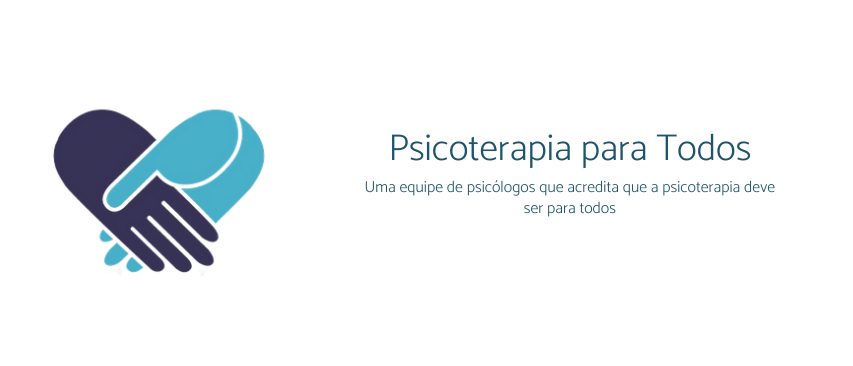
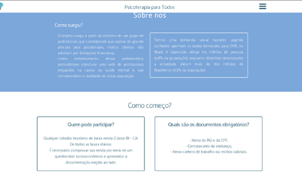

<h1 align="center">
    
</h1>

<h4 align="center"> 
	🚧 Projeto Psicoterapia para Todos 1.0 - sempre em construção... 🚧
</h4>

<p align="center">
  

  
  
  <a href="https://github.com/BeatrizMiranda/Psicoterapia/commits/master">
    
  </a>

  
</p>


## 💻 Sobre o projeto

Este projeto colaborativo foi o responsável por criar o site da ONG Psicoterapia Para Todos, um site Institucional onde a população pode obter contactar, se inscrever, e entender como funciona o projeto social.

No site os usuários terão acesso:
- Sobre nós
- Como começo?
- Como me inscrevo?    
- Consultas 
- Cadastre-se
- O que guia o projeto?

A iniciativa de criar o site nasceu quando a ONG entrou em contato com o Institudo Federal de Ciência Educação e Tecnologia de São Paulo, e o projeto de extensão IF{Meninas nas exatas} se responsabilizou pelo seu desenvolvimento.

## 🎨 Layout

O layout do site foi pensado a transimitir calma aos usuários, tendo em vista que a procura por saúde mental muitas vezes vem de alguém que já está no seu limite, buscamos manter a interface limpa, clara, e azul.

### Screens

<p align="center">
  
  
</p>

## 🛠 Tecnologias

As seguintes ferramentas foram usadas na construção do projeto:
- [HTML][html]
- [CSS][css]
- [PHP][php]

## :calling: Como executar o projeto

### Pré-requisitos

Antes de começar, você vai precisar ter instalado em sua máquina as seguintes ferramentas:
[Git](https://git-scm.com), 

Além disto é bom ter um editor para trabalhar com o código como [VSCode][vscode]

### :cat: Clonando o Repositório

```bash
# Clone este repositório
$ git clone https://github.com/BeatrizMiranda/Psicoterapia
            
# Acesse a pasta do projeto no terminal/cmd
$ cd Psicoterapia
```

### :repeat: Rodando a aplicação
```bash
# Execute a aplicação
$ yarn start (um escrip que executará o comando expo start)

```

## :raising_hand: Para contribuir com o projeto

1. Faça um **fork** do projeto.
2. Crie uma nova branch com as suas alterações: `git checkout -b my-feature`
3. Salve as alterações e crie uma mensagem de commit contando o que você fez: `git commit -m "feature: My new feature"`
4. Envie as suas alterações: `git push origin my-feature`
> Caso tenha alguma dúvida confira este [guia de como contribuir no GitHub](https://github.com/firstcontributions/first-contributions)

## 📝 Licença

Feito por: Beatriz Miranda, Laura Chaile, Angelo Lanch
Este projeto está sobe a licença MIT.


[nodejs]: https://nodejs.org/
[typescript]: https://www.typescriptlang.org/
[expo]: https://expo.io/
[rn]: https://facebook.github.io/react-native/
[yarn]: https://yarnpkg.com/
[vscode]: https://code.visualstudio.com/
[vceditconfig]: https://marketplace.visualstudio.com/items?itemName=EditorConfig.EditorConfig
[license]: https://opensource.org/licenses/MIT
